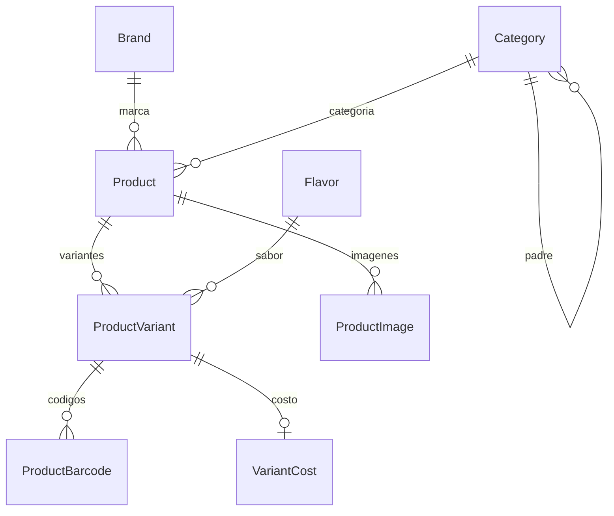
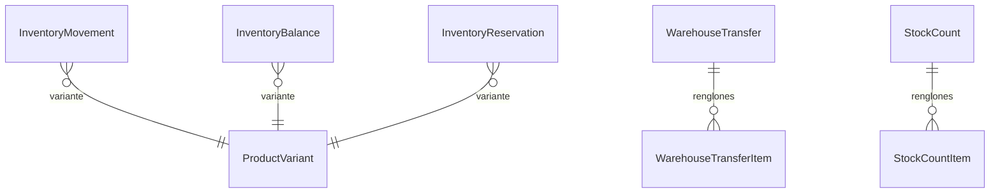

# Modelo de datos — Catálogo e Inventario (Prompt 2)

Fuente de verdad: [`packages/database/prisma/schema.prisma`](../../packages/database/prisma/schema.prisma).
Cantidades = `Decimal(18,6)`, dinero = `Decimal(18,4)`. IDs = UUID v7. Todas las tablas
llevan `organizationId` con RLS (aislamiento de tenant).

## Catálogo (ADR-015)

- `ProductVariant.sku` único por organización; inventario/precios/costos a nivel variante.
- `ProductBarcode` (EAN/UPC/CODE128/QR_INTERNAL/OTHER), único por organización, indexado.
- `ProductImage`: binario en FileStorageProvider (no en Postgres), URLs firmadas.

## Inventario (ADR-010/011/012/017)

- **`InventoryMovement`** — ledger append-only (fuente de verdad física). `@@unique(org, idempotencyKey)`.
- **`InventoryBalance`** — proyección `onHand/reserved/allocated/damaged/quarantine/inTransit*`, `version`. `@@unique(org, warehouse, variant)`. Reconstruible desde el ledger.
- **`InventoryReservation` / `InventoryAllocation`** — subledgers de disponibilidad.
- **`InventoryPolicy`** — `minimumStock/safetyStock/reorderPoint/targetStock` por (warehouse, variant).
- **`WarehouseTransfer(+Item)`** — ciclo con tránsito; `sourceWarehouse != destination` (CHECK).
- **`StockCount(+Item)`**, **`AdjustmentRequest`** — conteos y ajustes con aprobación.

## Constraints de integridad (nivel BD)
`quantity > 0` (movimientos/reservas/ajustes/renglones), `price >= 0`, `minimumPrice >= 0`,
`averageCost >= 0`, todas las columnas de `InventoryBalance >= 0`,
`sourceWarehouseId <> destinationWarehouseId`. Únicos: `(org, sku)`, `(org, barcode)`.

## Índices clave
`InventoryMovement`: `(org, warehouse, variant, createdAt)`, `(org, variant, createdAt)`,
`(org, movementType, createdAt)`, `(referenceType, referenceId)`, `correlationId`.
Catálogo: `(org, status)`, `brandId`, `categoryId`, `barcode`.

## Proyección vs. ledger
`InventoryBalance` es proyección, no historia. `rebuildInventoryBalance()` la reconstruye
y el job `inventory.balance.verify` (worker) detecta drift comparando
`computeBalanceBuckets` (ledger + subledgers) contra la proyección — sin corregir en
silencio (ADR-011).
