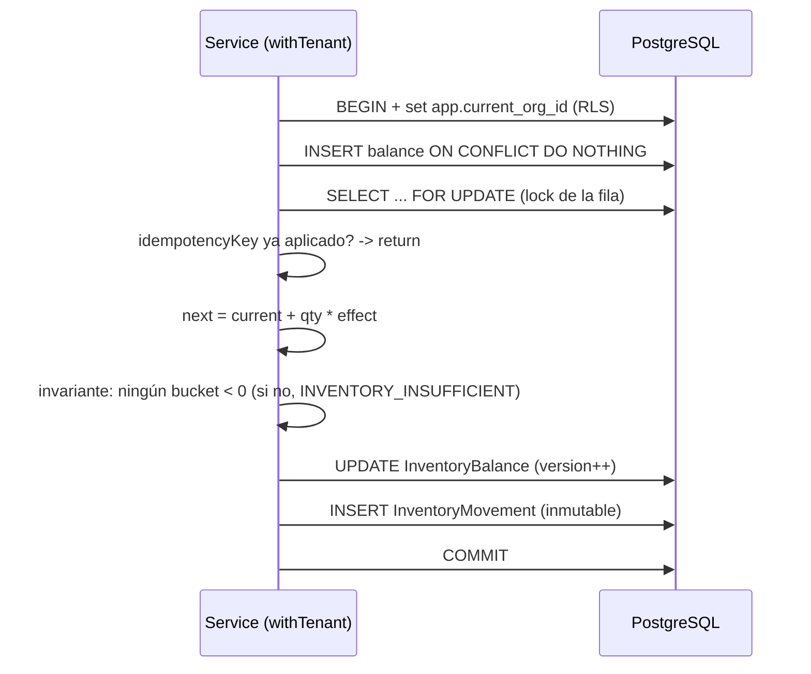

# Ledger de inventario

Fuente de verdad de existencias físicas (ADR-010, ADR-011). **El stock no es un campo
editable**: es la consecuencia de movimientos auditables e inmutables.

## Componentes
- **`InventoryMovement`** — ledger append-only. Cada mutación física es un movimiento
  (`movementType`, `direction`, `quantity > 0`, referencia, usuario, `correlationId`,
  `idempotencyKey`). Nunca se edita ni se borra; las correcciones son movimientos
  compensatorios.
- **`InventoryBalance`** — proyección transaccional por `(organization, warehouse,
  variant)` con `onHand, reserved, allocated, damaged, quarantine, inTransit*, version`.
  Se actualiza en la MISMA transacción que el movimiento. Reconstruible desde el ledger.
- **`MOVEMENT_EFFECTS`** (`inventory.effects.ts`) — mapa único de cómo cada tipo de
  movimiento afecta cada bucket. Lo usan el motor (`applyMovement`) y el `rebuild`, de
  modo que ledger y proyección nunca divergen por lógica duplicada.

## Disponibilidad
```
available = onHand - reserved - allocated - damaged - quarantine
```
`available` nunca puede ser negativo; lo garantizan la validación de invariante y el
`CHECK` de BD (`chk_balance_nonneg`).

## Flujo de una operación física (atómica)


## Concurrencia (ADR-013)
El `SELECT ... FOR UPDATE` sobre la fila de balance serializa a los competidores de la
misma `(warehouse, variant)`. Ante la última unidad, solo una reserva gana; la otra
recibe `INVENTORY_INSUFFICIENT`. Probado en `test/inventory.integration.test.ts`.

## Idempotencia
Operaciones con `idempotencyKey` (`opening-balance`, `manual-adjustments`, reservas)
son idempotentes: un reintento con la misma key no duplica movimientos (unique
`(organizationId, idempotencyKey)` + verificación dentro del lock).

## Integridad: rebuild y drift (ADR-011)
- `rebuildInventoryBalance()` reproyecta el balance desde el ledger + subledgers.
- `verifyDrift()` compara proyección vs. ledger y **reporta** inconsistencias (no
  corrige en silencio). Expuesto en `GET /inventory/verify` y usado por el worker.

## Tipos de movimiento
`OPENING_BALANCE, MANUAL_IN/OUT, PURCHASE_RECEIPT, SALE, SALE_REVERSAL, CUSTOMER_RETURN,
SUPPLIER_RETURN, TRANSFER_OUT/IN, DAMAGE, LOSS, THEFT, SAMPLE, WARRANTY_IN/OUT,
COUNT_ADJUSTMENT_IN/OUT, INTERNAL_CONSUMPTION, QUARANTINE_IN/OUT` y los neutrales
`RESERVATION*/ALLOCATION*` (subledger, sin efecto físico).
