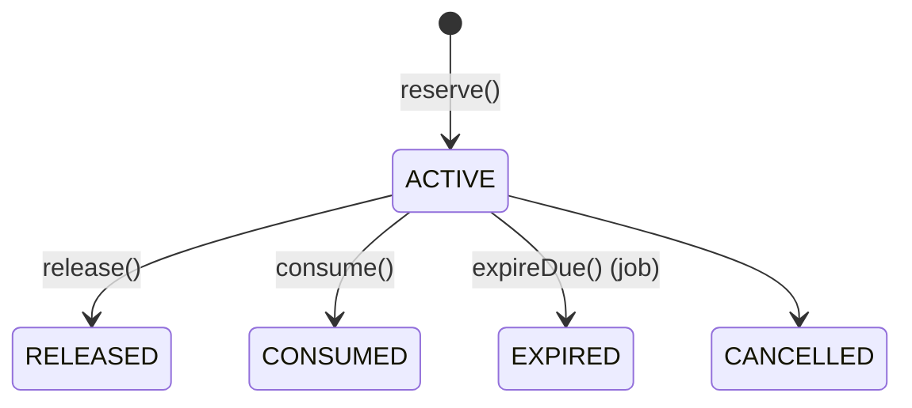

# Reservas de inventario

Reservar **no cambia la existencia física** (`onHand`), cambia la **disponibilidad**
(`available`). Por eso las reservas son un subledger separado del ledger físico
(ADR-012).

## Modelo
`InventoryReservation` (`quantity`, `status`, `referenceType/Id`, `expiresAt?`,
`idempotencyKey?`). Estados:


El efecto sobre disponibilidad se lleva en `InventoryBalance.reserved`:
- `reserve()` incrementa `reserved` (→ baja `available`).
- `release()`/`expire()` decrementan `reserved` (→ restaura `available`).
- `consume()` decrementa `reserved` **y** aplica un movimiento físico OUT (baja `onHand`).

## Atomicidad y concurrencia
Toda operación abre transacción (`withTenant`), **bloquea la fila de balance**
(`SELECT ... FOR UPDATE`) y valida `available >= quantity` antes de incrementar
`reserved`. Bajo la última unidad, solo una reserva gana; la otra falla con
`INVENTORY_INSUFFICIENT`. Nunca queda `reserved` mayor de lo posible.

## Idempotencia
Con `idempotencyKey`, un reintento devuelve la reserva existente sin duplicar
(unique `(organizationId, idempotencyKey)` verificado dentro del lock).

## Expiración (worker)
`expireDue()` libera reservas `ACTIVE` con `expiresAt` vencido → `EXPIRED`, devolviendo
disponibilidad. Es idempotente y **nunca** toca reservas `CONSUMED`.

## API
```
POST /api/v1/inventory/reservations          -> reserve
POST /api/v1/inventory/reservations/:id/release -> release
```
`consume()` está disponible en el servicio para cuando Ventas (Prompt 3+) convierta una
reserva en salida real; no se fabrica lógica de ventas en esta fase.
