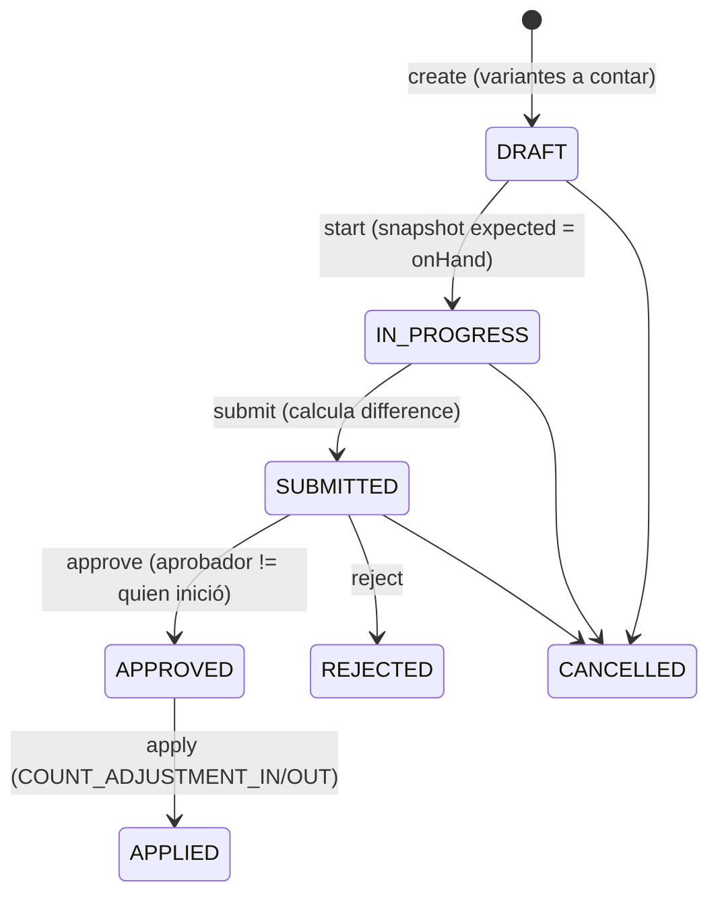

# Conteos físicos

Conteo de existencias con snapshot de lo esperado, conteo ciego, aprobación con
separación de funciones y aplicación al ledger (inmutable tras aplicar).

## Máquina de estados


## Reglas
- **Snapshot**: al `start`, `expectedQuantity` se fija con el `onHand` actual de cada
  variante en el almacén. No cambia después.
- **Conteo ciego** (`blindCount = true`): mientras se cuenta (`IN_PROGRESS`) el usuario
  **no ve** `expectedQuantity` ni `difference` (se ocultan en la respuesta).
- **submit**: calcula `difference = counted - expected` por renglón.
- **approve**: separación de funciones — **quien inició el conteo no puede aprobarlo**.
- **apply**: por cada diferencia distinta de cero genera un movimiento
  `COUNT_ADJUSTMENT_IN` (sobrante) o `COUNT_ADJUSTMENT_OUT` (faltante) con
  `idempotencyKey = count:<id>:<item>`. El conteo pasa a `APPLIED` y es **inmutable**:
  reintentar `apply` devuelve `STOCK_COUNT_ALREADY_APPLIED`.

## Ajustes que requieren aprobación
Los ajustes manuales grandes (por umbral) crean un `AdjustmentRequest` PENDING que exige
aprobación de otra persona antes de tocar el ledger (`inventory.adjust.approve`). Los
conteos siguen el mismo principio de separación de funciones.

## API
```
POST /api/v1/stock-counts             -> create
POST /api/v1/stock-counts/:id/start   -> IN_PROGRESS (snapshot)
POST /api/v1/stock-counts/:id/count   -> captura countedQuantity
POST /api/v1/stock-counts/:id/submit  -> SUBMITTED (difference)
POST /api/v1/stock-counts/:id/approve -> APPROVED
POST /api/v1/stock-counts/:id/apply   -> APPLIED (ledger)
```
Permisos: `inventory.count` (operar) y `inventory.count.approve` (aprobar/aplicar).
