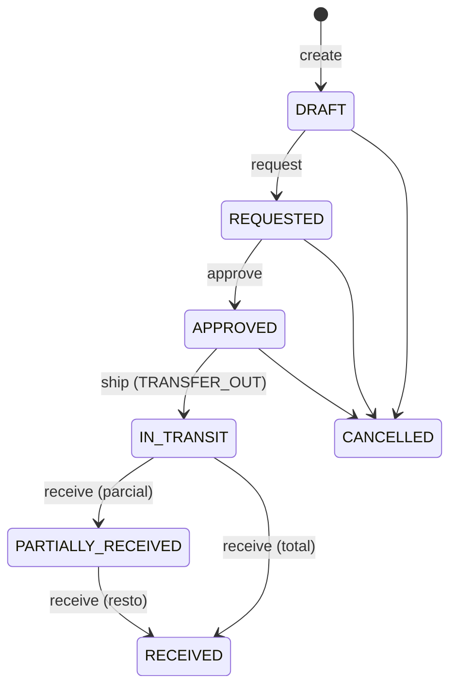

# Transferencias entre almacenes

Mover inventario de A a B con estado en tránsito, recepción parcial y trazabilidad
completa (ADR-017). Nunca un "move atómico" A→B sin tránsito.

## Máquina de estados

`CANCELLED` no es posible una vez en tránsito (la mercancía ya salió).

## Efecto sobre inventario
- **ship**: en el **origen** se aplica `TRANSFER_OUT` (`onHand -= enviado`). La mercancía
  entra en tránsito: `origen.inTransitOutgoing += enviado` y
  `destino.inTransitIncoming += enviado`. No está disponible en ninguno.
- **receive**: en el **destino** se aplica `TRANSFER_IN` (`onHand += recibido`) y se reduce
  el tránsito en ambos. Soporta **parcial**: si se envían 10 y se reciben 9, el faltante
  (1) queda como **incidencia abierta** en `PARTIALLY_RECEIVED`; nunca se completa solo.

## Tránsito como subledger
`inTransitIncoming/Outgoing` **no** se derivan de los movimientos, sino de los
`WarehouseTransferItem` abiertos (`shipped - received` sobre transferencias
`IN_TRANSIT`/`PARTIALLY_RECEIVED`). Así el `rebuild` los reconstruye sin contar dos veces
(igual filosofía que `reserved` desde reservas, ADR-012).

## Atomicidad y concurrencia
`ship`/`receive` corren en una transacción `withTenant`; cada renglón bloquea las filas de
balance (`SELECT … FOR UPDATE` vía `applyMovement`). No puede enviarse más de `onHand`
(`INVENTORY_INSUFFICIENT`) ni recibirse más de lo enviado pendiente
(`TRANSFER_INVALID_STATE`).

## API
```
POST /api/v1/transfers                -> create (DRAFT + items)
POST /api/v1/transfers/:id/request    -> REQUESTED
POST /api/v1/transfers/:id/approve    -> APPROVED
POST /api/v1/transfers/:id/ship       -> IN_TRANSIT
POST /api/v1/transfers/:id/receive    -> RECEIVED | PARTIALLY_RECEIVED
POST /api/v1/transfers/:id/cancel     -> CANCELLED
```
Permisos: `inventory.transfer.{create,approve,ship,receive}`.
