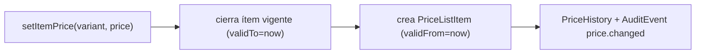

# Modelo de precios y costos

Decimal exacto en todo (ADR-016/014), nunca float. Costos filtrados en el backend.

## Precios (listas)
- `PriceList` (`RETAIL/WHOLESALE/SPECIAL`, moneda, sucursal/segmento opcional, vigencias).
- `PriceListItem` (`variantId`, `price`, `minimumPrice?`, `validFrom`, `validTo?`).
- `PriceHistory` (append-only): al fijar un precio se **cierra** el ítem vigente
  (`validTo = now`), se **crea** uno nuevo y se registra el cambio (`old→new`,
  `changedBy`, `correlationId`) + `AuditEvent` (`price.changed`).
- **Precio vigente**: por lista+variante con `validFrom <= now` y (`validTo` nulo o
  futuro), el más reciente. El historial nunca se pierde.

## Costos (promedio móvil)
- `VariantCost` (`averageCost`, `lastPurchaseCost`, `quantityOnHand`, `currency`, `version`).
- `CostHistory` (append-only) con `sourceType`
  (`OPENING_BALANCE`, `MANUAL_COST_INITIALIZATION`, `ADJUSTMENT_COST`, futuro
  `PURCHASE_RECEIPT`).
- Entrada de mercancía → costo promedio móvil:
  `newAvg = (prevQty·prevAvg + inQty·inUnit) / (prevQty + inQty)`.
  **No se recalcula la historia**; el costo aplicado a cada transacción se guarda como
  snapshot (`InventoryMovement.unitCost`).
- Inicialización/ajuste manual (`setCost`) fija el promedio directamente y registra
  `CostHistory`.

## Seguridad de costos
Los endpoints `/costs/*` exigen `costs.read` / `costs.manage`. El dashboard de
inventario **omite** el valor de inventario si el usuario no tiene `costs.read` — el
filtrado ocurre en el backend, no solo en la UI.
