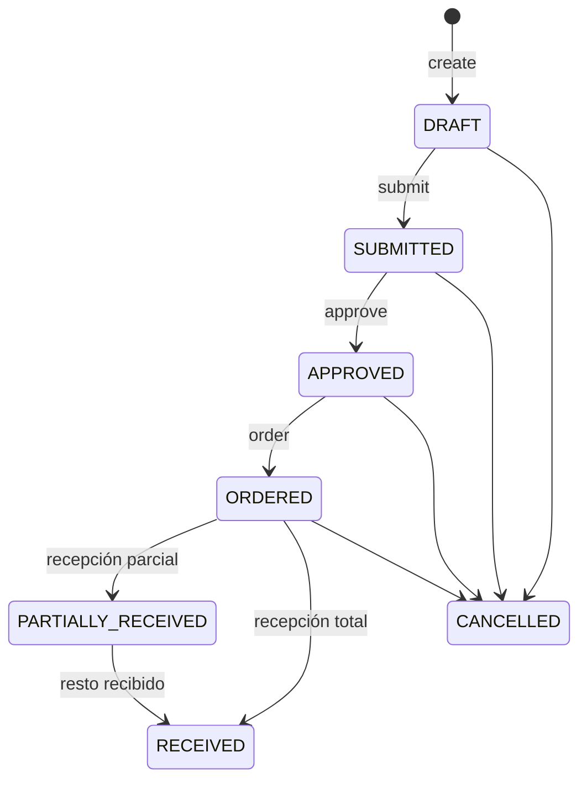

# Compras y proveedores

Proveedores, órdenes de compra y recepciones. La recepción es el único punto que toca
inventario y costo (ADR-018, ADR-019).

## Entidades
- `Supplier` (+`ProductSupplierReference`): proveedor y su relación con variantes
  (SKU del proveedor, último costo, lead time, preferido).
- `PurchaseOrder` (+`Item`): orden con totales (subtotal, impuestos, total en Decimal).
- `PurchaseReceipt` (+`Item`): recepción de mercancía, contra una PO o standalone.

## Ciclo de la orden de compra


## Recepción → inventario + costo (ADR-019)
`PurchaseReceipt.post()` ejecuta, por renglón y en UNA transacción:
1. Movimiento `PURCHASE_RECEIPT` (`onHand += cantidad`, snapshot de costo) vía el motor
   de inventario (bloqueo `FOR UPDATE`, invariante no-negativa).
2. **Costo promedio móvil** (`applyInboundCost`): `newAvg = (prevQty·prevAvg + inQty·inUnit)/(prevQty+inQty)`.
3. Actualiza `lastCost` en la referencia proveedor↔variante.
4. Concilia la PO (incrementa `receivedQuantity`; estado `PARTIALLY_RECEIVED`/`RECEIVED`).
5. Recibo → `POSTED`. `AuditEvent` `purchase.received`.

**Idempotencia**: re-postear un recibo `POSTED` devuelve `PURCHASE_ALREADY_POSTED`; el
inventario y el costo se aplican una sola vez.

## Devolución a proveedor
`SUPPLIER_RETURN` (`onHand -= cantidad`) — no es un borrado; queda en el ledger.

## API
```
GET/POST /api/v1/suppliers · POST /suppliers/:id/references
GET/POST /api/v1/purchase-orders · POST /purchase-orders/:id/{submit,approve,order,cancel}
GET/POST /api/v1/purchase-receipts · POST /purchase-receipts/:id/post
POST /api/v1/supplier-returns
```
Permisos: `suppliers.{read,manage}`, `purchasing.read`,
`purchase.order.{create,approve}`, `purchase.receipt.post`, `purchase.return`.
Ejemplo de RBAC: **Finance** ve compras (`purchasing.read`) pero no crea órdenes ni
recibe; **Warehouse Manager** puede postear recepciones.
